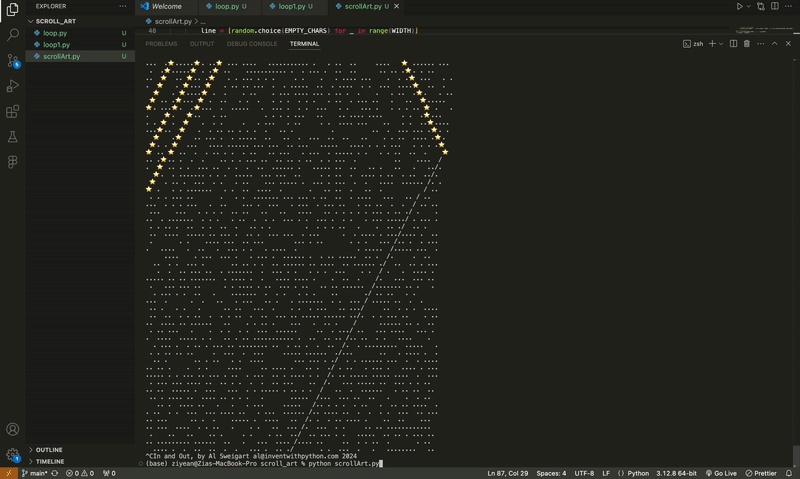
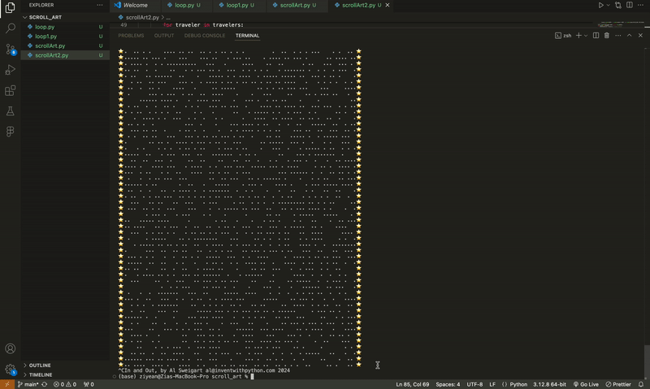
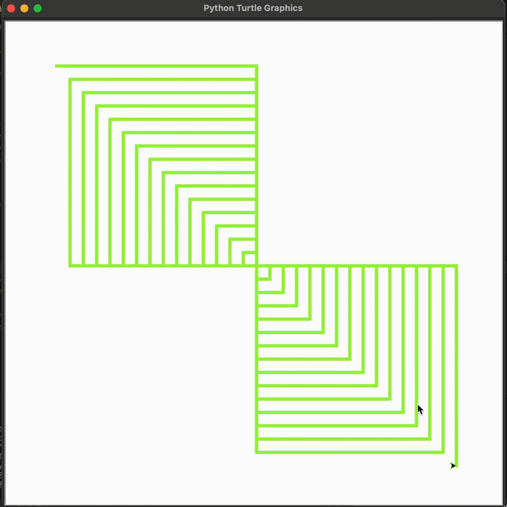
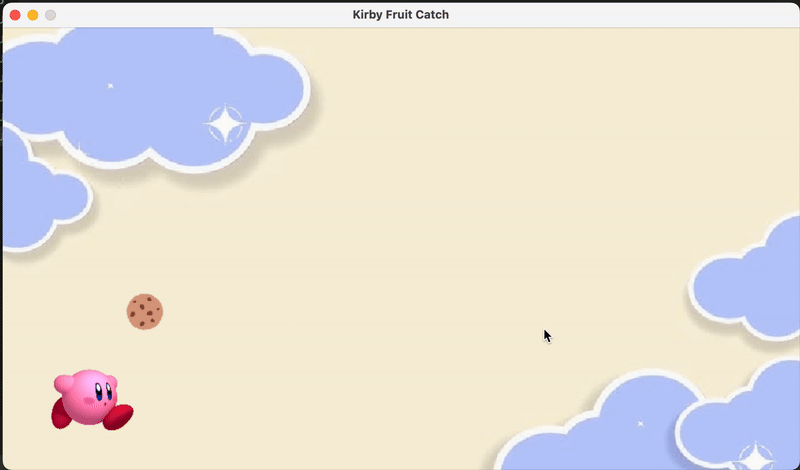
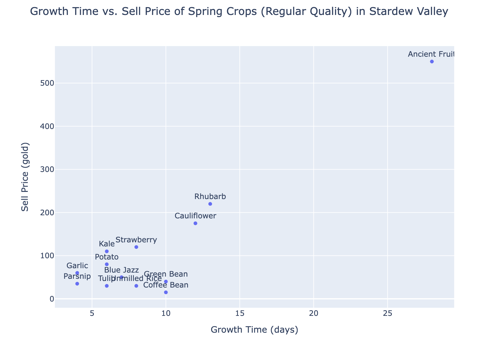
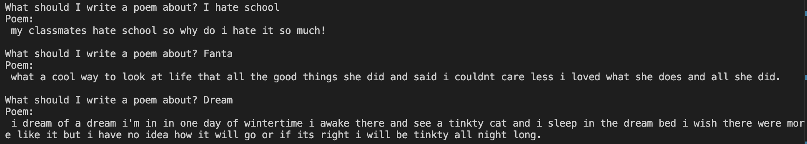

# Ziye's Creative Coding: Python Repo, Spring 2025
Welcome to my page where all my exporation on python exists. 😌 

## Table of Content
- [Week 1](#week-1) 
- [Week 2](#week-2)
- [Week 4](#week-4)
- [Week 5](#week-5)
- [Week 6](#week-6)
- [Week 7](#week-7)

### Week 1
**Inclass Notes**
-  github repo
-  [Markdown documentation](https://docs.github.com/en/get-started/writing-on-github/getting-started-with-writing-and-formatting-on-github/basic-writing-and-formatting-syntax#images)
- resources I use: [bilibili](https://www.bilibili.com/video/BV1rAH5e9EPh/?spm_id_from=333.337.search-card.all.click)

### Week 2 Py5
**Assignment**
Py5 Art work recreation
- selected work:[Frank Stella "Star of Persia"](https://www.google.com/url?sa=i&url=https%3A%2F%2Fwww.ohiomagazine.com%2Farts%2Farticle%2Flines-edges-frank-stella-on-paper-at-pizzuti-collection&psig=AOvVaw3rXXrbIomeAXxSDAQiXP8W&ust=1739233410930000&source=images&cd=vfe&opi=89978449&ved=0CBcQjhxqFwoTCJDp58Hrt4sDFQAAAAAdAAAAABAE)
- [My Code](py5/py5_Feb9.py)

- Beside just replicating the visual, I also add mouse-pressed() for interaction, while the mouse is pressed, there will be one more triangle added to the canvas

### Week 4 Scroll Art
**Assignment**
- Reference Code: [In and Out By Al Sweigart](https://scrollart.org/in-and-out/)
- [My Code](scroll_art/scrollArt.py)
- Iteration 1:

- Iteration 2:

- Final Iteration:

### Week 5 Turtle
**Assignment**
- Reference: [Frank Stella](https://www.caviar20.com/cdn/shop/products/Caviar20_Frank-Stella-HamptonRoads_1971_04_800x.jpg?v=1623678869)
- [My Code](turtle/assignment.py)

### Week 6 Pygame
**Assignment** Kirby
- [My Code](pygame/kirby.py)
- [pygame/kirby_pygame.mov](https://youtu.be/HW52wi_WUso)

### Week 7 Data Visualization
**Assignment** Stardew Valley Spring Crops Visualization
- [My Code](data_visualization/main.py)

### Week 8 Stardew Valley Wiki Web Scraper
This project scrapes character data from the [Stardew Valley Wiki - Villagers Page](https://stardewvalleywiki.com/Villagers).

## 🔍 What It Does

1. Scrapes the following from the main villagers page:
   - Character **names**
   - **Image URLs**
   - **Links** to their individual character pages
2. Visits each character's page to scrape additional **detailed info** (like quotes).
3. Saves all collected data into a CSV file.

[Click to view Detailed Description](https://github.com/ZiyeAn/Creative_Coding_Python/blob/main/web_scrap/README.md)

### Week 9 LLM Model

I used the [flan-t5-base](https://huggingface.co/google/flan-t5-base). It works but didn't really work well.
[code](LLM/main.py)

