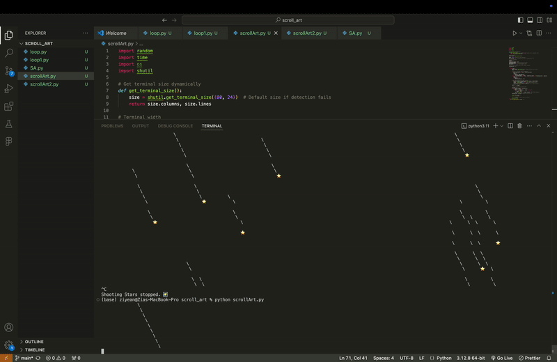

# Ziye's Creative Coding: Python Repo, Spring 2025
Welcome to my page where all my exporation on python exists. 😌 


## Table of Content
- [Week 1](#week-1) 
- [Week 2](#week-2)
- [Week 4](#week-4)
- [Week 5](#week-5)
- [Week 6](#week-6)
- [Week 7](#week-7)

### Week 1
**Inclass Notes**
-  github repo
-  [Markdown documentation](https://docs.github.com/en/get-started/writing-on-github/getting-started-with-writing-and-formatting-on-github/basic-writing-and-formatting-syntax#images)
- resources I use: [bilibili](https://www.bilibili.com/video/BV1rAH5e9EPh/?spm_id_from=333.337.search-card.all.click)

### Week 2 Py5
**Assignment**
Py5 Art work recreation
- selected work:[Frank Stella "Star of Persia"](https://www.google.com/url?sa=i&url=https%3A%2F%2Fwww.ohiomagazine.com%2Farts%2Farticle%2Flines-edges-frank-stella-on-paper-at-pizzuti-collection&psig=AOvVaw3rXXrbIomeAXxSDAQiXP8W&ust=1739233410930000&source=images&cd=vfe&opi=89978449&ved=0CBcQjhxqFwoTCJDp58Hrt4sDFQAAAAAdAAAAABAE)
- [My Code](py5/py5_Feb9.py)

- Beside just replicating the visual, I also add mouse-pressed() for interaction, while the mouse is pressed, there will be one more triangle added to the canvas

### Week 4 Scroll Art
**Assignment**
- Reference Code: [In and Out By Al Sweigart](https://scrollart.org/in-and-out/)
- [My Code](scroll_art/scrollArt.py)
- Iteration 1:

- Iteration 2:

- Final Iteration:


### Week 5 Turtle
**Assignment**
- Reference: [Frank Stella](https://www.caviar20.com/cdn/shop/products/Caviar20_Frank-Stella-HamptonRoads_1971_04_800x.jpg?v=1623678869)
- [My Code](turtle/assignment.py)


### Week 6 Pygame
**Assignment** Kirby
- [My Code](pygame/kirby.py)
- [pygame/kirby_pygame.mov](https://youtu.be/HW52wi_WUso)


### Week 7 Data Visualization
**Assignment** Stardew Valley Spring Crops Visualization
- [My Code](data_visualization/main.py)


### Week 8 Stardew Valley Wiki Web Scraper
[Detailed Description](web-scrap/README.md)
# 🌾 Stardew Valley Web Scraper

This project scrapes character data from the [Stardew Valley Wiki - Villagers Page](https://stardewvalleywiki.com/Villagers).

## 🔍 What It Does

1. Scrapes the following from the main villagers page:
   - Character **names**
   - **Image URLs**
   - **Links** to their individual character pages
2. Visits each character's page to scrape additional **detailed info** (like quotes).
3. Saves all collected data into a CSV file.

---

## 🔁 Iterations & Fixes

### 🧩 Problem 1: SSL Certificate Error

**Error:**  

urlopen error [SSL: CERTIFICATE_VERIFY_FAILED] certificate verify failed: unable to get local issuer certificate

**Reason:**  
Python was trying to securely connect to HTTPS image URLs, but my system didn’t have the required SSL certificates installed.

**Solution:**  
Run the following command to install the necessary certificates:
```bash
/Applications/Python\ 3.12/Install\ Certificates.command


⸻

🧩 Problem 2: 403 Forbidden Error While Downloading Images

Reason:
Websites often block requests that don’t appear to come from a real browser.

Solution:
Set a browser-like User-Agent in the header when downloading images:

import os
import urllib.request
from urllib.error import HTTPError, URLError

os.makedirs('images', exist_ok=True)  # Create folder for images
headers = {'User-Agent': 'Mozilla/5.0'}

for index, url in enumerate(imgs):
    file_name = f'img_{index}.jpg'
    full_path = os.path.join('images', file_name)
    print(file_name)

    req = urllib.request.Request(url, headers=headers)

    try:
        with urllib.request.urlopen(req) as response:
            with open(full_path, 'wb') as f:
                f.write(response.read())
    except HTTPError as e:
        print(f'HTTPError for {url}: {e.code}')
    except URLError as e:
        print(f'URLError for {url}: {e.reason}')


⸻

🧩 Problem 3: Using a Literal String in Requests

Mistake:

infoResponse = requests.get("https://stardewvalleywiki.com/{name}")

Reason:
This treats {name} as a literal string instead of using the actual variable.

Solution:
Use an f-string to insert the value of name into the URL:

url_name = name.replace(" ", "_")  # Adjust for wiki formatting
info_url = f"https://stardewvalleywiki.com/{url_name}"
infoResponse = requests.get(info_url)


⸻

✅ Final Output

All character data (name, image URL, link, quote) is saved into a final CSV file for further use.
